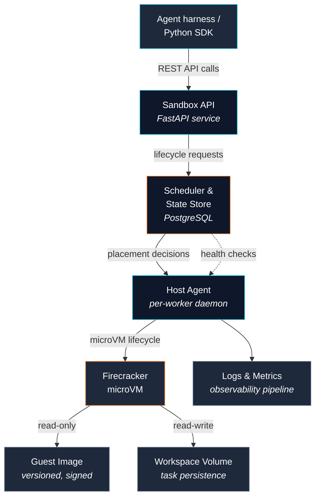

# Architecture

This section documents the internal design of Fireagent — the components, their responsibilities, and how they interact to create, observe, and destroy stateful microVM sandboxes at scale.

## Guiding principles

- **A sandbox is a stateful session**, not a one-shot command.
- **Firecracker provides the guest isolation boundary.** Host services must still assume guest code is hostile.
- **Use a small immutable base image** and mount task-specific writable state separately.
- **Make limits explicit.** Every sandbox has defined CPU, memory, disk, network, and lifetime policy.
- **Separate control from execution.** The API and scheduler manage sandboxes; isolated host agents run them.
- **Keep lifecycle observable.** Every transition and failure should be queryable.

## Architecture diagram

## Components at a glance

-   :material-api: **Sandbox API** – FastAPI service that validates requests, enforces policies, records state, and dispatches lifecycle commands. It does *not* execute guest commands directly.
-   :material-sitemap: **Scheduler** – Selects a host with available CPU, memory, and disk. Enforces placement policies and tenant quotas. Simple and database-backed for now.
-   :material-console: **Host Agent** – Runs on each Linux worker host. Manages Firecracker processes, TAP interfaces, drives, and host-level limits. Reports health and capacity.
-   :material-database: **State Store** – PostgreSQL persistence for sandbox metadata, lifecycle state, image references, network policies, and logs.
-   :material-harddisk: **Artifact & Workspace Storage** – Versioned guest images and task workspace volumes. Local SSD for Phase 1; interface is storage-agnostic.
-   :material-chart-line: **Observability Pipeline** – Structured logs, metrics, and events keyed to sandbox/tenant/host IDs.

## Where to go next

- [**Sandbox Lifecycle**](lifecycle.md) – Follow a sandbox from `queued` to `stopped`, with every state transition explained.
- [**Guest Image Construction**](guest-image.md) – How we build minimal, reproducible, verified Linux guest images.
- [**Host Agent**](host-agent.md) – Deep dive into the daemon that manages Firecracker processes.
- [**Networking Model**](networking.md) – Deny-by-default, TAP interfaces, egress proxy, and firewall rules.
- [**Resource Controls**](resource-controls.md) – cgroups, quotas, timeouts, and how limits are enforced.
- [**State Store**](state-store.md) – Schema, migrations, and query patterns for the PostgreSQL store.