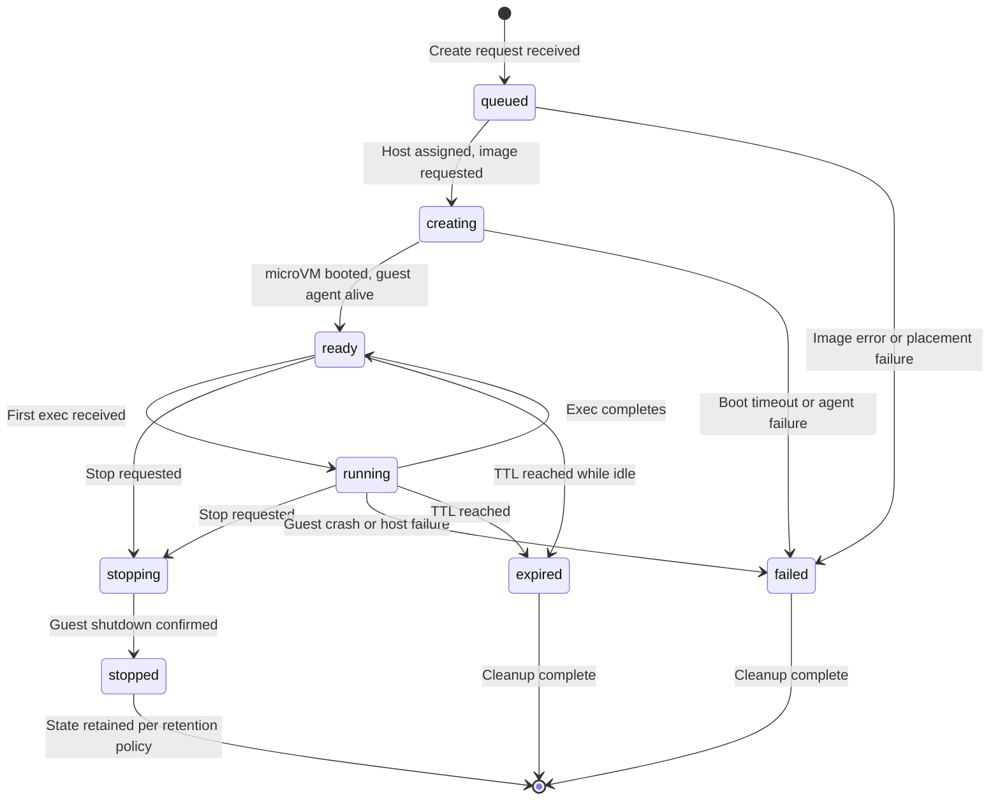

# Sandbox Lifecycle

A sandbox moves through a well-defined state machine. Every transition is recorded in the audit log, observable via the API, and idempotent.

## State machine



### State definitions

| State | Meaning | Typical duration |
|-------|---------|------------------|
| `queued` | Request received, awaiting host assignment | < 100 ms |
| `creating` | Host agent launching Firecracker, booting guest | 150 ms – 1 s |
| `ready` | Guest booted, agent ready, awaiting first command | Indeterminate |
| `running` | Command executing inside the microVM | Depends on command |
| `stopping` | Graceful shutdown in progress | < 5 s |
| `stopped` | microVM terminated, state retained for cleanup | Configurable |
| `failed` | Irrecoverable error | Until cleaned up |
| `expired` | TTL or idle timeout reached | Until cleaned up |

## Lifecycle events

### 1. Create

```
POST /v1/sandboxes
Idempotency-Key: <client-generated-key>
```

The API validates the request, checks tenant quotas, and requests host placement. The selected host agent:

1. Creates a working directory at `/var/fireagent/sandboxes/{sandbox_id}/`.
2. Sets up the Firecracker API socket at `firecracker.sock`.
3. Attaches the guest image as a read-only root drive.
4. Attaches an empty, writable workspace image as the secondary drive.
5. Configures the TAP interface and applies network rules.
6. Launches the Firecracker process with the jailer.
7. Waits for the guest agent to report healthy (heartbeat or connect).

On success, the sandbox reaches `ready`. On failure, it transitions to `failed` with a structured error.

**Idempotency guarantees:** If a client retries a create with the same `Idempotency-Key` within 5 minutes, the API returns the existing sandbox. The second request does not create a new microVM or consume additional resources.

### 2. Execute command

```
POST /v1/sandboxes/{id}/exec
```

Commands travel through this path:

```
Client → API → Scheduler → Host Agent → Guest Agent Channel → microVM shell
```

1. The API validates that the sandbox is in `ready` or `running` state.
2. The command, working directory, environment variables (from an allowlist), timeout, and optional stdin are forwarded to the host agent.
3. The host agent sends the execution request over the guest agent channel (a serial port or vsock-based protocol).
4. The guest agent spawns the command inside the guest, captures stdout/stderr, and monitors the timeout.
5. Output is streamed back (or buffered for short commands).
6. The result includes: `stdout`, `stderr`, `exit_code`, `start_time`, `finish_time`, `timed_out`, `oom_killed`.

### 3. Stop

```
POST /v1/sandboxes/{id}/stop
```

Graceful shutdown sequence:

1. If the sandbox is executing a command, the command is terminated (SIGTERM → SIGKILL after 2 s).
2. A graceful shutdown request is sent to the guest agent (or ACPI signal to Firecracker).
3. Host agent waits up to 5 seconds for the microVM process to exit.
4. If it hasn't exited, the Firecracker process is SIGKILL'd.
5. Workspace state is preserved according to retention policy.
6. Sandbox state set to `stopped`.

### 4. Delete

```
DELETE /v1/sandboxes/{id}
```

Terminates the microVM (if running) and removes writable state:

1. If sandbox is not `stopped` or `failed`, it is stopped first.
2. Workspace volume is detached and deleted (or archived, per tenant policy).
3. Working directory, Firecracker socket, and temporary files are removed.
4. TAP interface is deleted and firewall rules removed.
5. Sandbox record is soft-deleted or moved to a historical schema.

## Error categories

When a sandbox enters `failed`, the `failure_reason` field contains a structured
error category:

| Category | Meaning |
|----------|---------|
| `image_error` | Guest image not found, corrupt, or incompatible |
| `placement_failure` | No host with sufficient capacity available |
| `boot_timeout` | microVM did not reach ready state within timeout |
| `guest_agent_timeout` | Guest agent did not connect after boot |
| `resource_limit` | Guest exceeded CPU, memory, or disk limits |
| `network_denial` | A network policy was violated |
| `host_failure` | Host agent stopped reporting health |
| `user_cancellation` | Client cancelled the operation |
| `internal_error` | Unexpected platform error |

## Observing the lifecycle

Every state transition is recorded in the `audit_log` table:

```json
{
  "sandbox_id": "sb-a1b2c3d4",
  "event": "state_change",
  "from_state": "queued",
  "to_state": "creating",
  "timestamp": "2026-10-03T17:00:00.000Z",
  "actor": "scheduler",
  "metadata": {
    "host_id": "host-03",
    "image_digest": "sha256:abc123..."
  }
}
```

Clients can poll `GET /v1/sandboxes/{id}` to observe state changes, or
(eventually) subscribe to a webhook/event stream for push notifications.