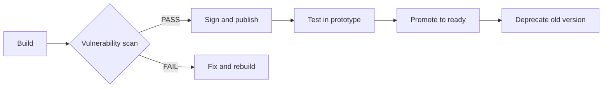

# Reproducible Builds

## Goal

Every guest image build should be **deterministic**: given the same inputs, the build produces the same output, regardless of when or where it is run.

## Why this matters

- **Security**: You can verify that an image hasn't been tampered with
- **Auditability**: You know exactly what went into every image version
- **Repeatability**: You can rebuild an old image if needed
- **Collaboration**: Multiple people can build the same image independently

## Build process

### Build environment

All guest images are built using **Docker** with pinned base images:

```dockerfile
# Dockerfile.build
FROM ubuntu:24.04@sha256:abc123...

COPY buildroot-config /buildroot/config
COPY patches /buildroot/patches

RUN apt update && apt install -y build-essential libncurses-dev
RUN make -C /buildroot
```

Pinning the base image (`ubuntu:24.04@sha256:abc123...`) ensures the build environment is the same every time.

### Pinned dependencies

All packages are pinned to specific versions:

```bash
# packages.txt
python3=3.12.3
git=2.43.0
curl=8.5.0
wget=1.21.4
openssh-client=1:9.6p1
ca-certificates=20240203
buildroot=2025.02
linux-kernel=6.8.0
```

No `latest`, no `unstable`, no `HEAD`.

### Build script

```bash
#!/bin/bash
# build-image.sh
set -euo pipefail

IMAGE_NAME="${1:-ubuntu}"
IMAGE_VERSION="${2:-24.04}"
BUILD_DIR="/tmp/fireagent-build-$$"
OUTPUT_DIR="/artifacts/images/$IMAGE_NAME:$IMAGE_VERSION"

echo "=== Building guest image: $IMAGE_NAME:$IMAGE_VERSION ==="

# Step 1: Setup buildroot
echo "[1/5] Setting up buildroot"
mkdir -p "$BUILD_DIR"
cp -r images/buildroot "$BUILD_DIR"
cd "$BUILD_DIR/buildroot"

# Step 2: Apply config
echo "[2/5] Applying configuration"
cp config/$IMAGE_NAME:$IMAGE_VERSION.cfg .config

# Step 3: Build
echo "[3/5] Building (this may take 10-15 minutes)"
make -j$(nproc)

# Step 4: Verify
echo "[4/5] Verifying build outputs"
test -f output/images/rootfs.cpio
test -f output/images/kernel

# Step 5: Convert and store
echo "[5/5] Converting to ext4 and storing"
dd if=/dev/zero of=rootfs.ext4 bs=1M count=400
mkfs.ext4 -F -b 4096 -i 4096 -m 1 -L rootfs rootfs.ext4
mount -o loop rootfs.ext4 /mnt
cd /mnt
zcat "$BUILD_DIR/buildroot/output/images/rootfs.cpio" | cpio -id
cd "$BUILD_DIR"
umount /mnt

# Copy to artifact storage
mkdir -p "$OUTPUT_DIR"
cp rootfs.ext4 "$OUTPUT_DIR/"
cp output/images/kernel "$OUTPUT_DIR/"
cp output/images/rootfs.cpio "$OUTPUT_DIR/"

# Generate digest
sha256sum rootfs.ext4 > "$OUTPUT_DIR/rootfs.ext4.sha256"

echo "=== Build complete ==="
echo "Image: $OUTPUT_DIR"
echo "Digest: $(cat $OUTPUT_DIR/rootfs.ext4.sha256)"
```

## Verification

### Digest matching

Every image is verified against its published digest:

```bash
verify_image() {
    local image_path="$1"
    local expected_digest="$2"
    local actual_digest=$(sha256sum "$image_path" | cut -d' ' -f1)

    if [ "$actual_digest" != "$expected_digest" ]; then
        echo "ERROR: Digest mismatch!"
        echo "Expected: $expected_digest"
        echo "Actual:   $actual_digest"
        exit 1
    fi
    echo "Digest verified (SHA256: $actual_digest)"
}
```

### GPG signing

Images are signed with the Fireagent build key:

```bash
gpg --detach-sign --armor rootfs.ext4
```

Hosts verify the signature before using the image:

```bash
gpg --verify rootfs.ext4.asc rootfs.ext4
```

### SBOM generation

A Software Bill of Materials (SBOM) is generated for every image:

```bash
syft rootfs.ext4 -o spdx-json > sbom.json
```

The SBOM includes:
- Package name and version
- License
- Source URL
- Vulnerability scan results

## Vulnerability scanning

```bash
trivy image --exit-code 1 --severity HIGH,CRITICAL rootfs.ext4
```

If any HIGH or CRITICAL vulnerability is found, the build fails.

## Traced build attestations

Every build records:

| Field | Value |
|-------|-------|
| Build ID | `build-abc123` |
| Image | `ubuntu:24.04` |
| Version | `ubuntu:24.04-rc2` |
| Build date | `2026-10-03T17:00:00Z` |
| Builder | `build-server-01` |
| Build tool | `buildroot-2025.02` |
| Build environment | `ubuntu:24.04@sha256:abc123...` |
| Packages | `python3=3.12.3, git=2.43.0, ...` |
| Digest | `sha256:def456...` |
| SBOM | `s3://fireagent-images/sbom/ubuntu:24.04-rc2.json` |
| Scan result | `PASS` |
| Scan report | `s3://fireagent-images/scans/ubuntu:24.04-rc2.html` |

## Image promotion



| Status | Action |
|--------|--------|
| `draft` | Built, not yet signed or scanned |
| `pending` | Signed and scanned, awaiting review |
| `approved` | Ready for host use |
| `deprecated` | New version available, old version not allowed |
| `removed` | Purged from artifact storage |