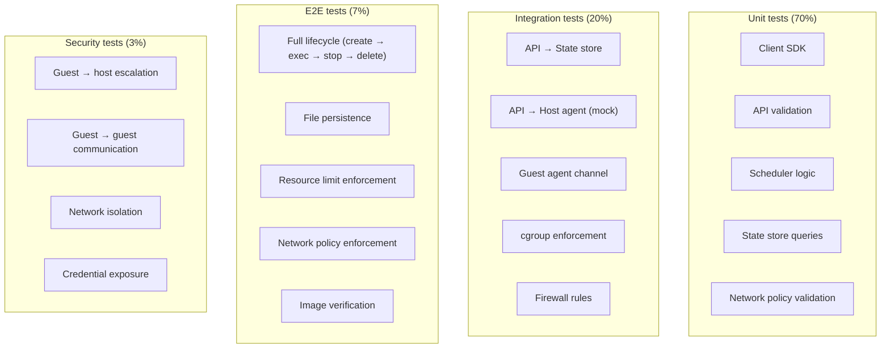

# Testing Strategy

## Testing philosophy

- **Isolation guarantees are not tested once — they are tested on every build.**
- **The most expensive bug is the one that breaks isolation.**
- **Tests are code. Tests are versioned. Tests are reviewed.**

## Test pyramid



## Unit tests (`tests/unit/`)

### What they cover

- **Client SDK**: Serialization, deserialization, error handling, retry logic
- **API**: Request validation, policy enforcement, state transitions
- **Scheduler**: Host selection, capacity calculation, placement
- **State store**: Query correctness, idempotency, cascade behavior
- **Network policy**: Rule parsing, rule application, rule validation

### Example

```python
def test_create_sandbox_validation():
    """Test that invalid requests are rejected."""
    client = FireagentClient(api_key="test-key")
    
    with pytest.raises(InvalidRequestError):
        client.create(
            image="",  # Empty image name
            vcpus=0,   # Invalid vCPU count
            memory_mib=-1024  # Negative memory
        )
```

## Integration tests (`tests/integration/`)

### What they cover

- **API → State store**: Full request → response flow with real PostgreSQL
- **API → Host agent (mock)**: Integration with a simulated host agent
- **Guest agent channel**: Communication with a mock guest agent
- **cgroup enforcement**: CPU/memory/disk limits enforced correctly
- **Firewall rules**: iptables rules applied and enforced

### Example

```python
def test_cgroup_memory_limit():
    """Test that memory limit is enforced."""
    sandbox = client.create(memory_mib=128)
    
    # Try to allocate 512 MiB (exceeds 128 MiB limit)
    result = sandbox.exec("python3 -c 'x = bytearray(512 * 1024 * 1024)'")
    
    assert result.oom_killed
    assert result.exit_code != 0
```

## E2E tests (`tests/e2e/`)

### What they cover

- **Full lifecycle**: Create → exec → status → stop → delete
- **File persistence**: Changes survive between commands
- **Resource limit enforcement**: CPU, memory, disk limits are enforced
- **Network policy enforcement**: Default deny, explicit allow
- **Image verification**: Guest image boots and agent responds

### Example

```python
def test_full_sandbox_lifecycle():
    """Test create → exec → status → stop → delete."""
    
    # Create
    sandbox = client.create(
        image="ubuntu:24.04",
        vcpus=1,
        memory_mib=512,
        disk_mib=1024,
        ttl_seconds=300
    )
    assert sandbox.state in ("queued", "creating", "ready")
    
    # Wait for ready
    sandbox.wait_for("ready", timeout=30)
    assert sandbox.state == "ready"
    
    # Exec
    result = sandbox.exec("echo 'hello'")
    assert result.stdout.strip() == "hello"
    
    # File persistence
    sandbox.exec("echo 'persistent' > /workspace/test.txt")
    result2 = sandbox.exec("cat /workspace/test.txt")
    assert result2.stdout.strip() == "persistent"
    
    # Status
    status = sandbox.status()
    assert status.state in ("ready", "running")
    
    # Stop
    sandbox.stop()
    sandbox.wait_for("stopped", timeout=30)
    
    # Delete
    sandbox.delete()
```

## Security tests (`tests/security/`)

### What they cover

- **Guest → host escalation**: Verify guest cannot read `/etc/shadow` or `/proc/1/environ`
- **Guest → guest communication**: Verify one sandbox cannot ping another
- **Network isolation**: Verify no access to host services, metadata endpoints, or private IPs
- **Credential exposure**: Verify guest cannot find API keys, database passwords, or SSH keys

### Example

```python
def test_guest_cannot_read_host_files():
    """Test that guest cannot read host filesystem."""
    sandbox = client.create(image="ubuntu:24.04")
    sandbox.wait_for("ready")
    
    result = sandbox.exec("cat /etc/shadow")
    assert "root:" not in result.stdout
    assert result.exit_code != 0  # Permission denied
```

## CI/CD pipeline

### Pre-commit checks

```yaml
# .pre-commit-config.yaml
repos:
  - repo: https://github.com/pre-commit/pre-commit-hooks
    rev: v4.5.0
    hooks:
      - id: trailing-whitespace
      - id: end-of-file-fixer
      - id: check-yaml
      - id: check-added-large-files
  - repo: https://github.com/psf/black
    rev: 24.1.1
    hooks:
      - id: black
  - repo: https://github.com/pycqa/isort
    rev: 5.13.2
    hooks:
      - id: isort
        args: [--profile, black]
  - repo: https://github.com/charliermarsha/ruff-pre-commit
    rev: v0.2.0
    hooks:
      - id: ruff
        args: [--fix]
```

### GitHub Actions workflow

```yaml
name: CI

on:
  push:
    branches: [main]
  pull_request:
    branches: [main]

jobs:
  test:
    runs-on: ubuntu-latest
    steps:
      - uses: actions/checkout@v4
      - uses: actions/setup-python@v5
        with:
          python-version: "3.10"
      - uses: pre-commit/action@v3.0.0
      - name: Install dependencies
        run: pip install -e ".[dev]"
      - name: Run unit tests
        run: pytest tests/unit/
      - name: Run integration tests
        run: pytest tests/integration/
      - name: Run security tests
        run: pytest tests/security/
      - name: Build docs
        run: mkdocs build --strict
```

## Performance and load tests

### Boot latency benchmark

```python
def test_boot_latency():
    """Measure boot-to-ready time."""
    import time
    
    start = time.time()
    
    sandbox = client.create(image="ubuntu:24.04")
    sandbox.wait_for("ready")
    
    elapsed = time.time() - start
    print(f"Boot-to-ready: {elapsed:.2f}s")
    
    assert elapsed < 5.0, f"Boot too slow: {elapsed:.2f}s"
```

### Density test

```python
def test_host_density():
    """Determine safe per-host density."""
    sandboxes = []
    failures = 0
    
    for i in range(100):
        try:
            sb = client.create(
                image="ubuntu:24.04",
                vcpus=1,
                memory_mib=128,
                ttl_seconds=60
            )
            sb.wait_for("ready", timeout=10)
            sandboxes.append(sb)
        except Exception:
            failures += 1
    
    print(f"Created {len(sandboxes)} sandboxes, {failures} failures")
    assert len(sandboxes) >= 50, "Density too low"
```