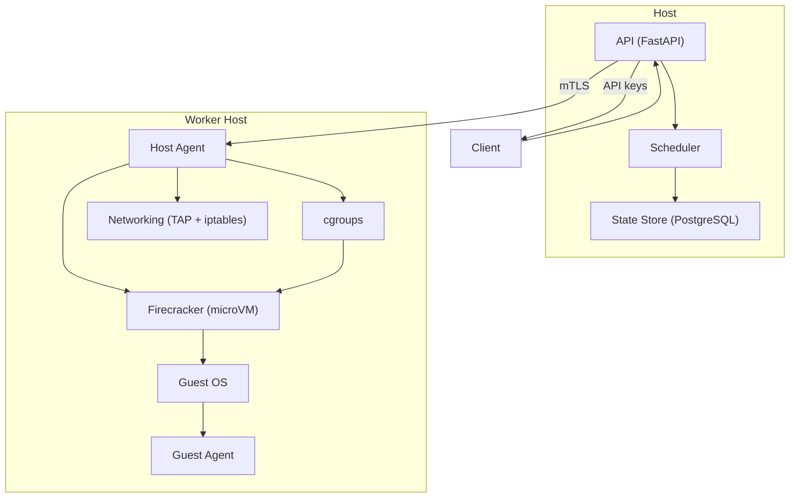

# Security

## Overview

Security is not a feature — it's the foundation. Fireagent is designed for running **untrusted code** from AI agents, model outputs, and third-party workloads. The platform must assume that every command, every repository, every package, and every model-generated instruction is hostile.

## Security principles

- **Treat everything as untrusted** – Guest code, repositories, packages, model outputs, and client requests.
- **No implicit trust** – No default credentials, no enabled services, no open ports.
- **Least privilege** – Every component runs with the minimum privileges required.
- **Default deny** – Network access is denied by default. Filesystem access is isolated. Cross-sandbox communication is blocked.
- **Observability is security** – Every action is logged and auditable.
- **Defense in depth** – Multiple layers of isolation (microVM, cgroups, seccomp, network rules).
- **Emergency kill path** – Host-level termination that bypasses all guest privileges.

## Security model

## What we protect

| Asset | Protection |
|-------|------------|
| Host FS & processes | microVM isolation, no host FS access |
| Other sandboxes | TAP isolation, no inter-VM routing |
| Control plane secrets | Environment var allowlist, no credential mounting |
| API keys | Bearer token auth, rate limited, tenant-scoped |
| Guest images | Verified digests, signed artifacts, versioned |
| Workspace data | Per-sandbox disk quota, deleted on delete |
| Network | Deny-by-default, explicit allow rules, egress proxy |
| Audit logs | Append-only, tamper-evident |

## Related topics

- [Threat Model](threat-model.md) – What we assume about attackers and attack vectors.
- [Isolation Guarantees](isolation.md) – How microVM, cgroups, seccomp, and filesystem isolation work together.
- [Network Security](network.md) – Firewall rules, egress proxy, and denial-of-service prevention.