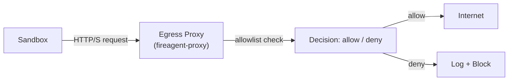

# Network Security

## Network architecture

Fireagent's network security model is built around three principles:

1. **Default deny** – No traffic is allowed unless explicitly permitted.
2. **No cross-sandbox communication** – Sandboxes cannot talk to each other.
3. **No host access** – Sandboxes cannot reach host services or the control plane.

## Firewall rules

### Default rules

Applied at host agent startup:

```bash
# Fireagent host firewall
*filter

# Default policies
:INPUT DROP [0:0]
:FORWARD DROP [0:0]
:OUTPUT DROP [0:0]

# Allow established connections
-A INPUT -m state --state ESTABLISHED,RELATED -j ACCEPT
-A OUTPUT -m state --state ESTABLISHED,RELATED -j ACCEPT

# Allow localhost
-A INPUT -i lo -j ACCEPT
-A OUTPUT -o lo -j ACCEPT

# Allow SSH (for admin access)
-A INPUT -p tcp --dport 22 -j ACCEPT

# Allow control plane (from hosts only)
-A INPUT -p tcp --dport 8000 -m state --state NEW -j ACCEPT

# Allow DNS (for host agent)
-A OUTPUT -p udp --dport 53 -m state --state NEW -j ACCEPT

# Log and drop everything else
-A INPUT -j LOG --log-prefix "fireagent-drop: "
-A FORWARD -j LOG --log-prefix "fireagent-drop: "
-A OUTPUT -j LOG --log-prefix "fireagent-drop: "

COMMIT
```

### Per-sandbox rules

Applied on sandbox creation:

```bash
# Per-sandbox iptables chain
-N sandbox-sb-a1b2c3

# Default: deny all inbound to this sandbox
-A INPUT -i tap-sb-a1b2c3 -j DROP

# Default: deny all outbound from this sandbox
-A OUTPUT -o tap-sb-a1b2c3 -j DROP

# If client specified allow rules, append them:
-A OUTPUT -o tap-sb-a1b2c3 -d 140.82.112.3 -p tcp --dport 443 -j ACCEPT
-A OUTPUT -o tap-sb-a1b2c3 -d 151.101.1.54 -p tcp --dport 443 -j ACCEPT

# Log denials
-A FORWARD -i tap-sb-a1b2c3 -j LOG --log-prefix "fireagent-deny:"
```

## Egress proxy

### Architecture

The egress proxy is an optional layer that provides secure outbound access:



### Proxy rules

The egress proxy applies per-tenant allowlists:

```yaml
# /etc/fireagent/proxy.yaml
tenants:
  ten-abc123:
    allowlist:
      - host: "github.com"
        port: 443
      - host: "pypi.org"
        port: 443
      - host: "registry.hub.docker.com"
        port: 443
  ten-def456:
    allowlist:
      - host: "*.myorg.com"
        port: 443
global:
  deny:
    - host: "169.254.169.254"  # Metadata endpoint
    - host: "127.0.0.0/8"       # Localhost
    - host: "10.0.0.0/8"        # Private network
    - host: "172.16.0.0/12"    # Private network
    - host: "192.168.0.0/16"   # Private network
```

## DDoS and resource exhaustion

### Network-level protections

- Outbound rate limiting (per sandbox, per tenant)
- Connection limits per sandbox
- No ICMP echo (ping) without explicit allow rule
- No UDP amplification vulnerability

### Host-level protections

- SYNFLOOD protection enabled
- Connection tracking with `connlimit` module
- Rate limiting via `hashlimit` module

### Control-plane protections

- Rate limiting at API level (1000 requests/minute/tenant)
- Connection pooling at database level
- Request body size limits (10 MiB)
- No anonymous access

## Logging

### What is logged

- All network policy denials (with sandbox ID, timestamp, destination, port)
- All egress proxy requests (with sandbox ID, timestamp, destination, port)
- Rate limit violations (with tenant ID, timestamp)

### What is NOT logged

- Full request/response payloads
- API keys or credentials
- Guest command output (except through execution audit)

## Prohibited traffic

| Destination | Why blocked |
|-------------|-------------|
| `169.254.169.254` | Cloud metadata endpoint |
| `127.0.0.0/8` | Host localhost |
| `10.0.0.0/8` | Private network (host services) |
| `172.16.0.0/12` | Private network |
| `192.168.0.0/16` | Private network |
| `0.0.0.0/8` | Invalid |
| `100.64.0.0/10` | Carrier-grade NAT |
| `198.18.0.0/15` | Benchmarking |

## Network policy example

```python
import fireagent as fa

# Create a sandbox with explicit network rules
sb = fa.create(
    image="ubuntu:24.04",
    network_policy={
        "rules": [
            {
                "action": "allow",
                "protocol": "tcp",
                "destination": "github.com",
                "port": 443,
                "description": "Clone repositories"
            }
        ]
    }
)
```

## Testing network security

```bash
# Test: can sandbox reach the internet?
curl https://google.com
# Result: curl: (7) Failed to connect to google.com port 443 after 0 ms: Connection refused

# Test: can sandbox reach host services?
curl http://127.0.0.1:8000
# Result: curl: (7) Failed to connect to 127.0.0.1 port 8000: Connection refused

# Test: can sandbox reach metadata endpoint?
curl http://169.254.169.254/latest/meta-data/
# Result: curl: (7) Failed to connect to 169.254.169.254 port 80: Connection timed out

# Test: can sandbox reach another sandbox?
ping 10.0.0.2
# Result: ping: connect: Network is unreachable

# Test: with explicit allow rule
curl https://github.com
# Result: <html>...<title>GitHub</title>...
```