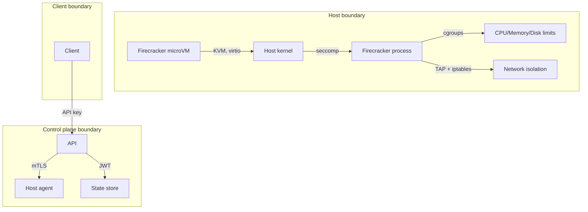

# Threat Model

## Scope

This threat model covers the Fireagent platform: the control plane (Sandbox API + Scheduler + State Store), host agent, Firecracker microVMs, guest images, and network infrastructure.

## Assets

| Asset | Description |
|-------|-------------|
| **Guest code** | Commands, repositories, and files executed inside sandboxes |
| **Workspace data** | User-uploaded files, repository clones, task inputs/outputs |
| **API credentials** | API keys, JWT tokens, tenant credentials |
| **Host credentials** | SSH keys, database passwords, signing keys |
| **Guest images** | Base OS images, versioned artifacts |
| **Control plane** | Sandbox API, scheduler, PostgreSQL state store |
| **Host agent** | Firecracker manager, cgroups, networking |
| **Network infrastructure** | Bridges, TAP interfaces, egress proxy |

## Threat actors

| Actor | Motivation | Access | Capability |
|-------|------------|--------|------------|
| **Guest attacker** | Escape sandbox, access host or other VMs | Guest shell via executed command | Low: seccomp-filtered, non-root guest user |
| **Network attacker** | Access host services, other VMs, cloud metadata | Network position (same host/network) | Medium: can attempt network-level attacks |
| **Malicious tenant** | Abuse platform: resource exhaustion, privilege escalation | Valid API key, sandbox creation/execution | Medium: can create many sandboxes, run arbitrary code |
| **Compromised host agent** | Take over host, launch attacks on other hosts | Root-equivalent access on worker | High: host agent has significant privileges |
| **Compromised control plane** | Access all sandboxes, tenant data, credentials | Full API + database access | Very High: has access to all sensitive data |
| **External adversary** | DDoS, data breach, service disruption | Limited (firewall-protected API) | Variable |

## Attack vectors

### 1. Guest → Host escalation

**Goal**: Break out of Firecracker microVM and execute code on the host kernel.

**Mitigations**:
- Firecracker's jailer applies seccomp filters and drops privileges
- Host kernel is patched and Firecracker version is pinned
- No host filesystem or devices are exposed to the guest
- cgroups enforce CPU/memory/disk limits — resource exhaustion cannot reach host services

**Risk**: Low. Firecracker has a small attack surface (KVM, virtio devices). Known CVEs are patched quickly.

### 2. Guest → Guest communication

**Goal**: Access another sandbox's files, processes, or network.

**Mitigations**:
- Each microVM has its own dedicated TAP interface
- TAP interfaces are isolated — no routing between them
- iptables rules deny all inbound/outbound traffic by default
- Each Firecracker process runs in its own working directory with unique permissions

**Risk**: Very Low. No cross-sandbox communication path exists.

### 3. Guest → Host network access

**Goal**: Access host services (SSH, HTTP, database) from inside guest.

**Mitigations**:
- Deny-by-default network policy at both inbound and outbound
- iptables rules block all private IP ranges (`10.0.0.0/8`, `172.16.0.0/12`, `192.168.0.0/16`, `127.0.0.0/8`)
- Cloud metadata endpoints (`169.254.169.254`) are explicitly blocked

**Risk**: Low. Network is firewalled at the host boundary.

### 4. Guest → External network abuse

**Goal**: Use sandbox for outbound attacks (spam, DDoS, crypto mining).

**Mitigations**:
- Deny-by-default outbound access
- Explicit allow rules for specific destinations and ports
- Egress proxy for logging and rate limiting
- Command execution timeout prevents long-running network operations

**Risk**: Low. Explicit allow lists prevent most abuse. Rate limiting caps damage.

### 5. Tenant → Platform abuse

**Goal**: Create excessive sandboxes, exhaust resources, degrade service for other tenants.

**Mitigations**:
- Per-tenant sandbox, memory, disk, and execution quotas
- Per-tenant rate limiting
- TTL and idle timeout to reclaim resources
- Admission control during overload

**Risk**: Medium. Quotas and rate limiting mitigate most abuse. Monitoring detects anomalous patterns.

### 6. API key compromise

**Goal**: Use stolen API key to create/manipulate sandboxes.

**Mitigations**:
- API keys are scoped to a single tenant
- Keys can be rotated on compromise
- All operations are logged with tenant ID and source IP
- Suspicious activity can trigger automatic key revocation

**Risk**: Medium. Key rotation and logging limit blast radius.

### 7. Supply chain: guest image

**Goal**: Inject malicious code into guest image.

**Mitigations**:
- Images are built from pinned packages in a controlled build environment
- Images are signed with GPG before distribution
- Digests are verified before use
- Vulnerability scanning before promotion

**Risk**: Low. Signed images and digest verification prevent injection.

### 8. Log injection

**Goal**: Inject malicious content into logs to exploit log aggregators or evade detection.

**Mitigations**:
- Logs are redacted — no secrets or full payloads
- Environment variables are filtered to an allowlist before logging
- No shell expansion in log messages
- Logs are JSON-structured, not free-form

**Risk**: Very Low.

## Security boundaries

## Incident response

| Event | Response |
|-------|----------|
| **Suspected guest escape** | Terminate all sandboxes on host, revoke host, analyze logs |
| **Network policy violation** | Log, increase rate limit for tenant, notify admin |
| **API key compromise** | Revoke key, invalidate sessions, rotate tenant keys |
| **Host agent compromise** | Take host offline, analyze forensic snapshot, rebuild host |
| **Control plane compromise** | Rotate all credentials, restore database from backup, rebuild |
| **Image tampering** | Revoke image version, rebuild from pinned deps, add verification step |
| **DDoS** | Enable rate limiting, trigger admission control, increase capacity |